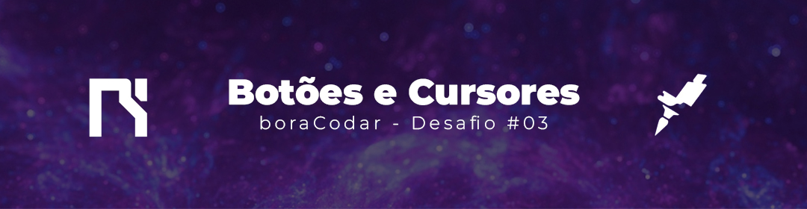

<link rel="stylesheet" href="style.css">
<link rel="stylesheet" href="readme.css">

<h1 class="titulo">Botões e Cursores - #boraCodar</h1>

Projeto desenvolvido durante o segundo desafio semanal da Rocketseat. O projeto desta semana trata-se de criar uma página moderna apresentando o design das diversas formas que os botões podem aparecer em um site utilizando conceitos de HTML e CSS. Mais informações sobre o desenvolvimento estão expostas abaixo.

 
<ul>
    <li><a href="https://boracodar.dev/?utm_source=youtube&utm_medium=organic&utm_campaign=lead&utm_term=boracodar&utm_content=descricao-boracodar_desafio01">Página dos desafios</a></li>
</ul>
 
<h2 class="subtit">👷‍ - Habilidades Desenvolvidas</h2>
 

✅ Desenvolvimento de layout moderno

✅ Variação e modificação de animações

✅ Responsividade

 
<h2 class="subtit">🛠 - Tecnologia Utilizadas</h2>
 

    
    

 
<h2 class="subtit">🎨 - Protótipo</h2>
 

Acesse o protótipo desenvolvido pela Rocketseat através deste <a href="https://www.figma.com/file/JmClvwuoNNp1ikYhGqS4eO/%23boraCodar---Desafio-3-(Community)?node-id=0%3A1&t=irsqovzKkavK4MQb-0">link</a>.

 
<h2 class="subtit">🔗 - Deploy</h2>
 

Acesse o projeto desenvolvido por mim através deste <a href="https://6wlrbp.csb.app/">link</a>.

    
