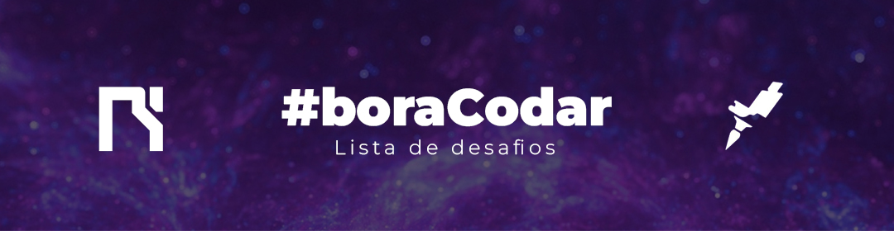

# Desafio #BoraCodar
 
Repositório criado para armazenar os desafios propostos pela Rocketseat que consistem em protótipos envolvendo diversas linguagens.
 
<h2>Lista de desafios</h2>
 
<ul>
    <li><a href="https://txpo17.csb.app/">🎧 Desafio 01 - Player de Música</a></li>
    <li><a href="https://chshc0.csb.app/">🛋 Desafio 02 - Product Card</a></li>
    <li><a href="https://6wlrbp.csb.app/">⏯ Desafio 03 - Botões e Cursores</a></li>
    <li><a href="https://571tz9.csb.app/">📲 Desafio 04 - Chat Personalizado</a></li>
    <li><a href="https://3obepw.csb.app/">📟 Desafio 05 - Calculadora</a></li>
    <li><a href="https://2hitl9.csb.app/">✈️ Desafio 06 - Cartão de Embarque</a></li>
    <li><a href="https://inkevf.csb.app/">🥳 Desafio 07 - Página de Pesquisa</a></li>
</ul>
 
